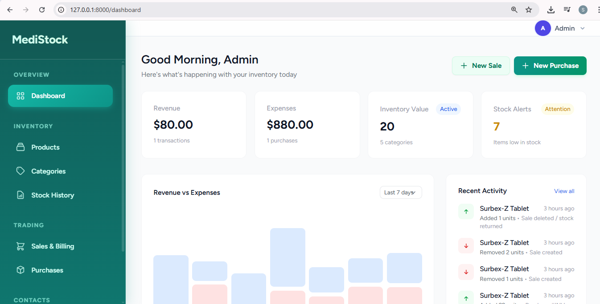
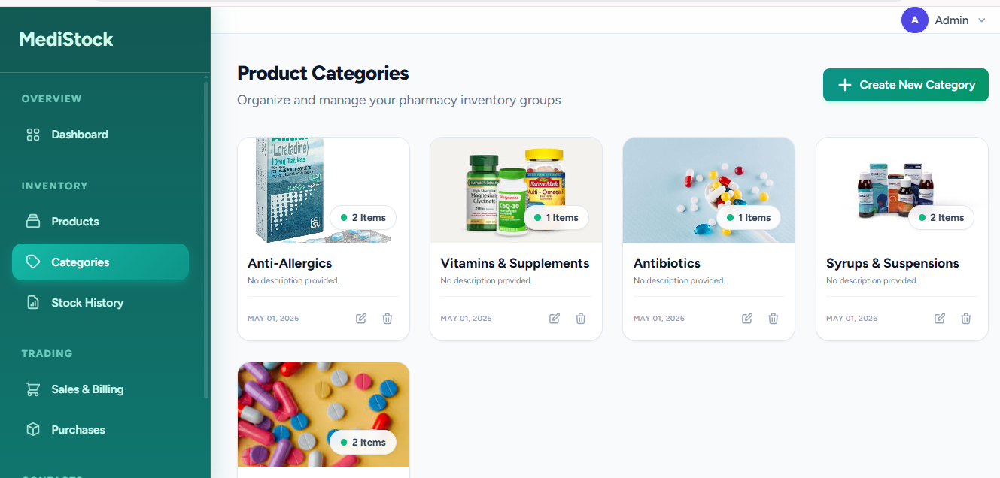
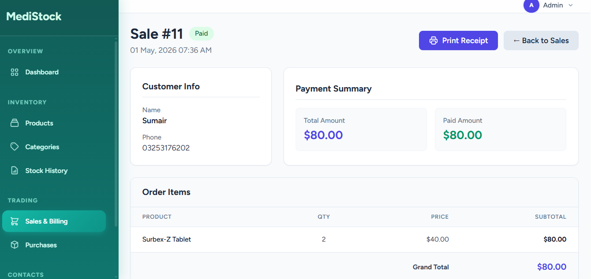
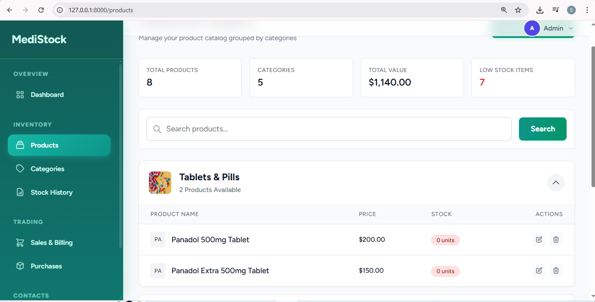
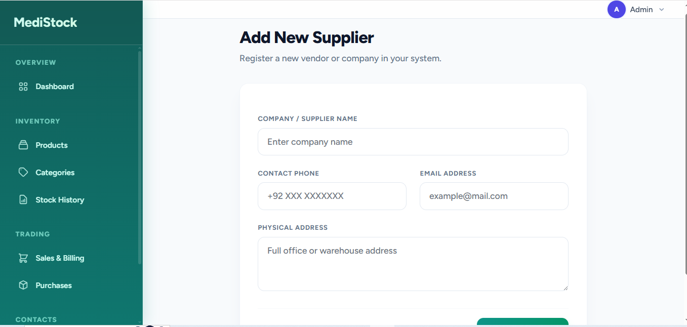
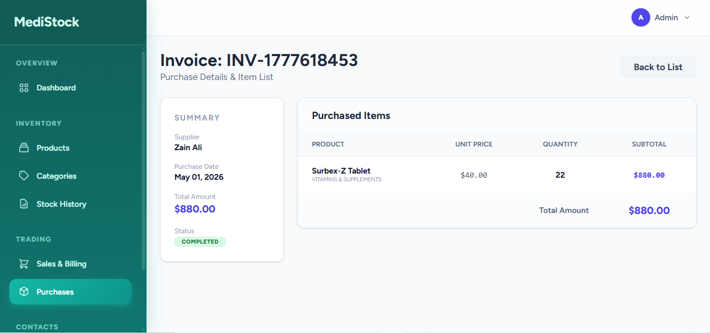
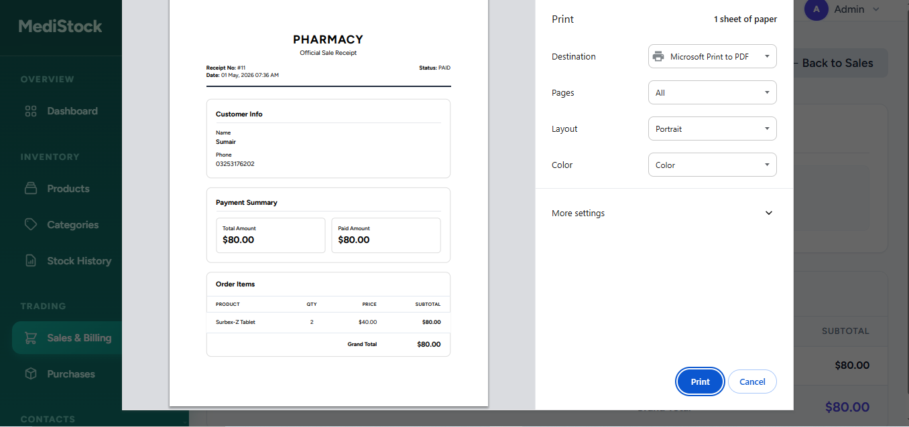

# MediStock - Professional Pharmacy Management System

MediStock is a modern, premium inventory and pharmacy management solution built with Laravel. It features a clean, professional medical-themed UI, real-time stock tracking, category-level image management, and detailed reporting.

##  Key Features

- **Professional Dashboard**: Real-time overview of revenue, expenses, and stock alerts.
- **Advanced Inventory**: Group products by categories with custom images.
- **Stock Tracking**: Automated stock-in/out tracking via Purchases and Sales.
- **POS / Sales System**: Easy-to-use billing interface with customer management.
- **QR Code Integration**: Automated QR code generation for every product.
- **Responsive Design**: Fully responsive UI built with Tailwind CSS and Alpine.js.

## 🖼 Project Preview

| Dashboard Overview | Product Categories |
| :---: | :---: |
|  |  |

| Sales System (POS) | Product Catalog |
| :---: | :---: |
|  |  |

| Suppliers Management | Incoming Purchases |
| :---: | :---: |
|  |  |

| Digital Receipts |
| :---: |
|  |

## Tech Stack

- **Backend**: Laravel 11 (PHP 8.2+)
- **Frontend**: Tailwind CSS, Alpine.js, Blade Templates
- **Database**: MySQL / SQLite
- **Icons/UI**: Custom SVG Icons & Premium Medical Color Palette

##  Installation Guide

To run this project locally, follow these steps:

1. **Clone the repository**:
   ```bash
   git clone https://github.com/yourusername/inventory-system.git
   cd inventory-system
   ```

2. **Install dependencies**:
   ```bash
   composer install
   npm install
   ```

3. **Environment Setup**:
   - Copy `.env.example` to `.env`
   - Create a database and update `DB_*` credentials in `.env`
   - Generate app key: `php artisan key:generate`

4. **Database Migration & Seeding**:
   Run the following command to set up the database and create the default admin account:
   ```bash
   php artisan migrate --seed
   ```

5. **Link Storage**:
   ```bash
   php artisan storage:link
   ```

6. **Start the Application**:
   ```bash
   npm run dev
   php artisan serve
   ```

##  Demo Credentials (For Testing)

You can log in to the admin panel using the following credentials after running the seeders:

- **URL**: `http://localhost:8000/login`
- **Email**: `admin@medistock.com`
- **Password**: `admin123`

---

